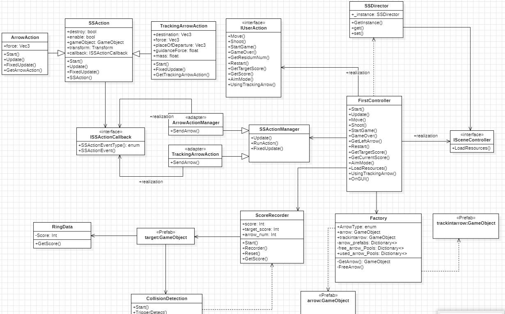

# arrow-world
## 1. 游戏背景

形成斑驳的光影。微风轻拂，树枝沙沙作响，周围一片宁静，唯有鸟鸣和远处溪流的流水声打破沉寂。靶场位于空旷的草地上，靶子分布在不同距离处，地面铺满了柔软的绿草，四周被古老的石墙环绕，墙面上覆盖着青苔，透露着岁月的痕迹。

这片靶场不仅是常规射箭练习的场地，更是为了特殊训练而设置。新的追踪箭功能加入了挑战，箭头在射出后会发出微弱的光辉，自动调整方向，精准地追踪移动的靶子。靶子不仅有静止的木制靶标，还有悬挂在树上的动态目标，随着风的变化轻轻摆动，增加了射箭的难度。最远处的靶子甚至会时不时地突然消失，考验玩家的反应和精准度。

玩家站在靶场的起点，手持弓和追踪箭，准备射向目标。在射出每一支追踪箭时，箭头的光芒闪烁，随着靶子的动态，它们会调整轨迹，确保命中靶心。这种神奇的力量让射箭变得既神秘又富有挑战性，增加了游戏的趣味和刺激。

通过这片森林中的靶场，玩家不仅能够体验精准射箭的技巧，还能借助追踪箭挑战更远、更复杂的目标，享受弓箭手的荣耀与乐趣。

## 2. uml图

