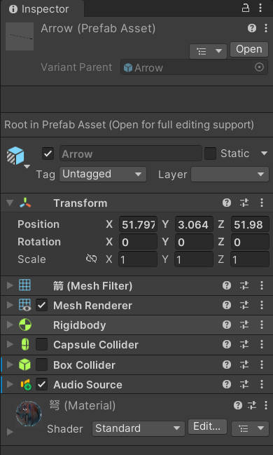

# arrow-world
## 1. 游戏背景

形成斑驳的光影。微风轻拂，树枝沙沙作响，周围一片宁静，唯有鸟鸣和远处溪流的流水声打破沉寂。靶场位于空旷的草地上，靶子分布在不同距离处，地面铺满了柔软的绿草，四周被古老的石墙环绕，墙面上覆盖着青苔，透露着岁月的痕迹。

这片靶场不仅是常规射箭练习的场地，更是为了特殊训练而设置。新的追踪箭功能加入了挑战，箭头在射出后会发出微弱的光辉，自动调整方向，精准地追踪移动的靶子。靶子不仅有静止的木制靶标，还有悬挂在树上的动态目标，随着风的变化轻轻摆动，增加了射箭的难度。最远处的靶子甚至会时不时地突然消失，考验玩家的反应和精准度。

玩家站在靶场的起点，手持弓和追踪箭，准备射向目标。在射出每一支追踪箭时，箭头的光芒闪烁，随着靶子的动态，它们会调整轨迹，确保命中靶心。这种神奇的力量让射箭变得既神秘又富有挑战性，增加了游戏的趣味和刺激。

通过这片森林中的靶场，玩家不仅能够体验精准射箭的技巧，还能借助追踪箭挑战更远、更复杂的目标，享受弓箭手的荣耀与乐趣。

## 2. uml图


## 3. 关键细节

### 3-1 关于未发生碰撞提早结束游戏的问题

实现code:
```
if (!isChecking)
{
    isChecking = true;
    Invoke("ResetArrowSpawnFlag", 1.8f);
    CheckGameStatus();
}
void ResetArrowSpawnFlag()
{
    isChecking = false;
}

```
下面是对这段代码的详细解释：

1. **条件判断 `if (!isChecking)`**：
   - 这行判断 `isChecking` 是否为 `false`，即当前没有正在进行“检查”操作。如果 `isChecking` 为 `false`，代码会执行大括号内的内容。如果 `isChecking` 为 `true`，说明当前正在进行某些检查操作，因此不会执行大括号内的代码。

2. **`isChecking = true;`**：
   - 将 `isChecking` 设置为 `true`，表示开始进行检查。这样做的目的是防止在检查过程中再次触发检查，确保只有一次检查在进行。

3. **`Invoke("ResetArrowSpawnFlag", 1.8f);`**：
   - `Invoke` 是 Unity 中的一种方法，用于延迟调用某个函数。这里的 `"ResetArrowSpawnFlag"` 是要调用的函数的名称，`1.8f` 是延迟的时间（单位为秒）。在 1.8 秒后，`ResetArrowSpawnFlag` 函数会被自动调用。

4. **`CheckGameStatus();`**：
   - 调用 `CheckGameStatus()` 函数，通常这个函数用来检查游戏的某个状态，比如是否可以生成箭，或者是否满足某个条件来触发某个事件。具体内容取决于 `CheckGameStatus()` 函数的实现。

5. **`void ResetArrowSpawnFlag()`**：
   - 这是一个定义了 `ResetArrowSpawnFlag` 函数的部分，该函数没有参数且返回类型为 `void`，表示没有返回值。

6. **`isChecking = false;`**：
   - 在 `ResetArrowSpawnFlag` 函数中，将 `isChecking` 设置为 `false`，表示检查操作已经完成，可以允许下一次检查操作的触发。

### 总结：

- **功能**：这段代码的目的是防止在检查期间重复触发某个操作，利用 `isChecking` 来确保只有一个检查操作正在进行。通过 `Invoke` 方法，延迟 1.8 秒后调用 `ResetArrowSpawnFlag` 函数，将 `isChecking` 设置为 `false`，允许下一次操作的开始。
  
- **流程**：
  - 当 `isChecking` 为 `false` 时，开始执行检查操作并将 `isChecking` 设置为 `true`。
  - 调用 `CheckGameStatus()` 来检查游戏状态。
  - 延迟 1.8 秒后，调用 `ResetArrowSpawnFlag()`，将 `isChecking` 设置为 `false`，以便后续操作可以继续进行。

这个机制通常用于控制某个频繁操作（如生成箭、游戏状态检查等）在一定时间内只能执行一次，避免重复执行造成的逻辑错误或性能问题。

### 3-2 跟踪箭的实现

实现code：
```
    public override void Start()
    {
        float velocityz = force.magnitude;
        // make it parents is null to sperate from factory
        this.MgameObject.transform.parent = null;

        this.MgameObject.GetComponent<Rigidbody>().useGravity = false;
        

        Vector3 direction = destination - this.MgameObject.transform .position;

        float distancex = destination.x - this.MgameObject.transform.position.x;
        float distancey = destination.y - this.MgameObject.transform.position.y;
        float distancez = destination.z - this.MgameObject.transform.position.z;

        float time = distancez / velocityz;

        float velocityx = distancex / time;
        float velocityy = distancey / time;
        
        Vector3 ultimatevelocity = new Vector3(velocityx, velocityy, velocityz);

        this.MgameObject.GetComponent<Rigidbody>() .velocity = ultimatevelocity;
    }
```

这段代码是一个 **Unity** 中的 `Start` 方法，通常用于在游戏对象开始时初始化某些操作。根据代码的描述，目的是让某个游戏对象（可能是一个箭）以特定的速度和方向飞向目标（`destination`）。其中，通过计算目标位置和初始位置之间的差距，来设置箭的最终速度，使其能够准确地到达目标。以下是逐步解析：

### 代码解析：

#### 1. **获取速度的大小**
```csharp
float velocityz = force.magnitude;
```
- 这行代码获取一个叫 `force` 的向量的大小（`magnitude`）。`force` 很可能是箭的初始速度或者施加在箭上的初始力的向量。通过 `force.magnitude` 计算得到的是箭的初始速度（`velocityz`），用于计算后续的速度和时间。

#### 2. **解除父对象约束**
```csharp
this.MgameObject.transform.parent = null;
```
- 这行代码将箭的父物体设置为 `null`，意味着箭将不再受到父物体（比如箭的生成工厂）的影响，从而能够自由飞行。

#### 3. **禁用重力**
```csharp
this.MgameObject.GetComponent<Rigidbody>().useGravity = false;
```
- 这行代码禁用了重力，意味着箭将不会受重力影响，除非你手动改变它的速度或施加力。

#### 4. **计算目标方向**
```csharp
Vector3 direction = destination - this.MgameObject.transform.position;
```
- 计算箭从当前位置 (`this.MgameObject.transform.position`) 到目标位置 (`destination`) 的方向向量 `direction`。

#### 5. **计算各轴的距离**
```csharp
float distancex = destination.x - this.MgameObject.transform.position.x;
float distancey = destination.y - this.MgameObject.transform.position.y;
float distancez = destination.z - this.MgameObject.transform.position.z;
```
- 分别计算目标在 `x`、`y` 和 `z` 轴上的距离。这是为了计算时间和最终的速度分量。

#### 6. **计算飞行时间**
```csharp
float time = distancez / velocityz;
```
- 计算箭到达目标的时间。通过目标的 `z` 轴距离除以箭在 `z` 轴方向上的速度 (`velocityz`) 来计算飞行时间。假设飞行时间是均匀的，并且箭的速度在 `z` 轴上不变。

#### 7. **计算每个轴上的速度**
```csharp
float velocityx = distancex / time;
float velocityy = distancey / time;
```
- 根据已知的时间 `time`，计算箭在 `x` 轴和 `y` 轴上的速度分量。这是通过距离除以时间来实现的。

#### 8. **最终速度**
```csharp
Vector3 ultimatevelocity = new Vector3(velocityx, velocityy, velocityz);
```
- 将 `x`、`y` 和 `z` 轴上的速度分量合成一个最终的速度向量 `ultimatevelocity`。这个向量表示箭在三维空间中需要的速度，以便它能够准确地飞向目标。

#### 9. **设置 Rigidbody 的速度**
```csharp
this.MgameObject.GetComponent<Rigidbody>().velocity = ultimatevelocity;
```
- 最后，设置箭的 `Rigidbody` 组件的 `velocity`（速度），以使箭按照计算的速度向量 `ultimatevelocity` 飞行。

### 总结：

这段代码实现了一个 **跟踪箭** 的功能，箭会根据目标的位置和初始速度，计算出飞行的方向和速度分量。它的主要步骤是：
1. 解除箭与父物体的约束。
2. 禁用重力影响。
3. 计算目标的方向和各轴上的距离。
4. 通过目标距离和初始速度计算飞行时间。
5. 计算在每个轴上的速度分量。
6. 设置箭的速度，使其能够精确地飞向目标。

这样一来，箭就能够自动计算和调整速度，保证准确飞向指定的目标位置，实现了一个简单的追踪箭的效果。

### 3-3 关于target-prefab的细节

首先这个prefab 是由五个环构成的，再一起放在一个空物体中最后形成了一个预制体,而且由于箭矢速度较快，所以每个环之间要有一定距离


需要注意的是因为箭矢的速度较快，所以要将其中的**fixed timestep 设置更小才能快速当collider detection时候能快速实现停止效果与音效**


脚本的添加只需要给target的子物体添加即可，还有RingData.cs只需要给子物体添加


此外不需要给这些设置Rigidbody刚体这个组件，Rigidbody只需给箭矢添加即可！



## 4. 视频demo
https://www.bilibili.com/video/BV1PfBXYZEZP/?vd_source=7a623e8d2983e451b1ad0356dd703610
